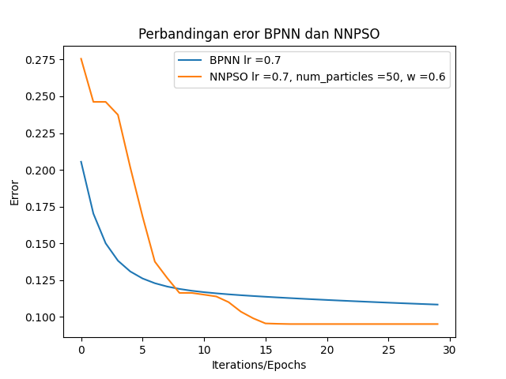

# Research: Gold Price Prediction with Hybrid Nueral Network

This is a repository for backpropagation optimization research

## Install Requirements

```
pip install -r requirements.txt
```

## Demo website

```
py app.py
```

## Research



Backpropagation can be optimized well with PSO. To see the research results, go to the 'penelitian' folder.

### Information

Additionally, if you have questions, discussions or want to continue research, don't hesitate to contact me on <a href="https://www.linkedin.com/in/zidni-zainul/">Linkedin</a>
